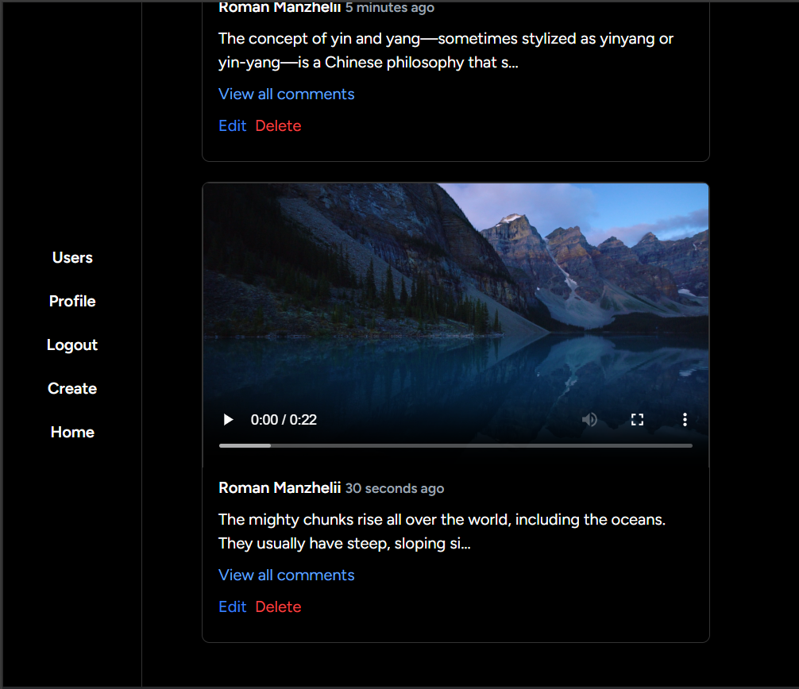
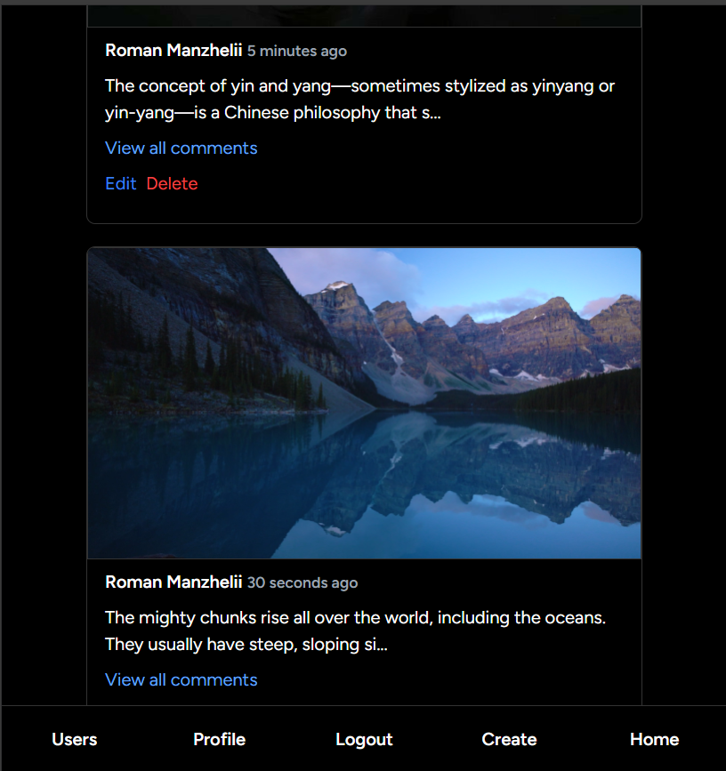
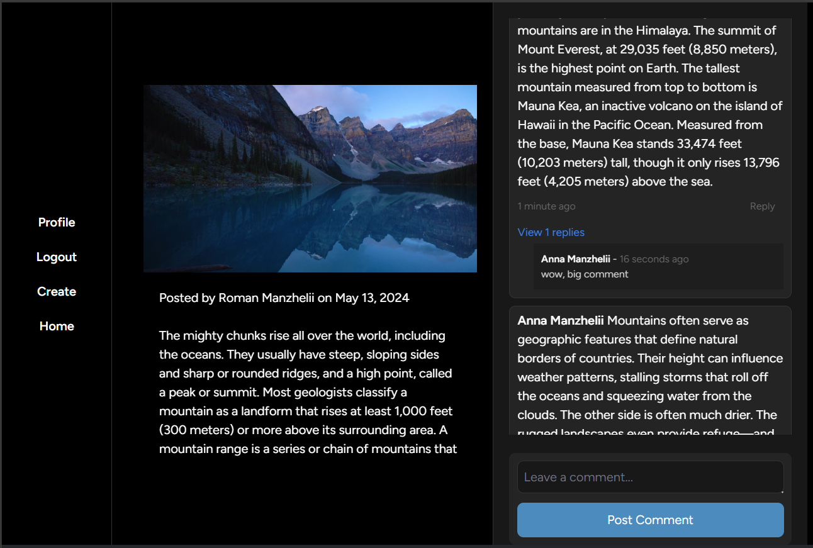
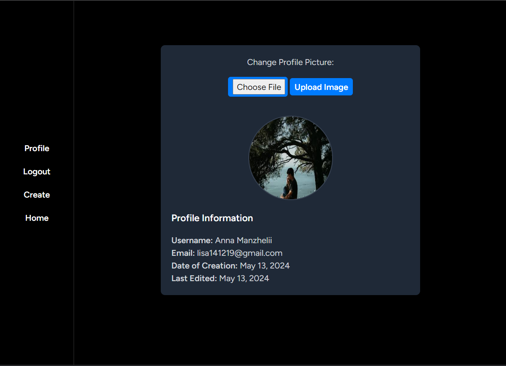

# CA3 Social Media App

For Server Side Web Development

## About

This CA we build a Social Media App where we can create Posts and Comment on them

We have 4 main pages for Guest
- Login
- Register
- Create
- Home

4 pages for User
- Profile
- Logout
- Create
- Home

Admin has an Extra Page to View & Delete Users

## Media









## Usage
Download this project with git
Then in the same folder run this to launch Styles
```bash
    npm run dev
```
After this run this command and access localhost:8000
```bash
    php artisan serve
```

## Tony References

Testing
- https://www.youtube.com/watch?v=UjA-16diixc
- https://stackoverflow.com/questions/39118117/how-to-execute-specific-test-class-using-phpunit-in-laravel

Profile Page
- https://laravelamit.medium.com/how-to-upload-profile-image-of-user-in-laravel-upload-profile-picture-in-laravel-registration-732e4a0d349f
- https://stackoverflow.com/questions/31893439/image-validation-in-laravel-5-intervention

Email
- https://medium.com/@miladev95/sending-a-welcome-email-after-user-registration-in-laravel-52843c3de30f
- https://laravel.com/docs/11.x/mail

I also looked at my own code from CA2 for Reminders, and also used Romans code as reference

## Roman References

Vite https://laravel.com/docs/11.x/vite

Tailwind https://tailwindcss.com/docs/guides/laravel

Laravel From Scratch https://www.youtube.com/watch?v=MYyJ4PuL4pY

Laravel CRUD https://www.youtube.com/watch?v=_LA9QsgJ0bw

CSS https://www.youtube.com/watch?v=OXGznpKZ_sA

Used same useful features from CA2 
